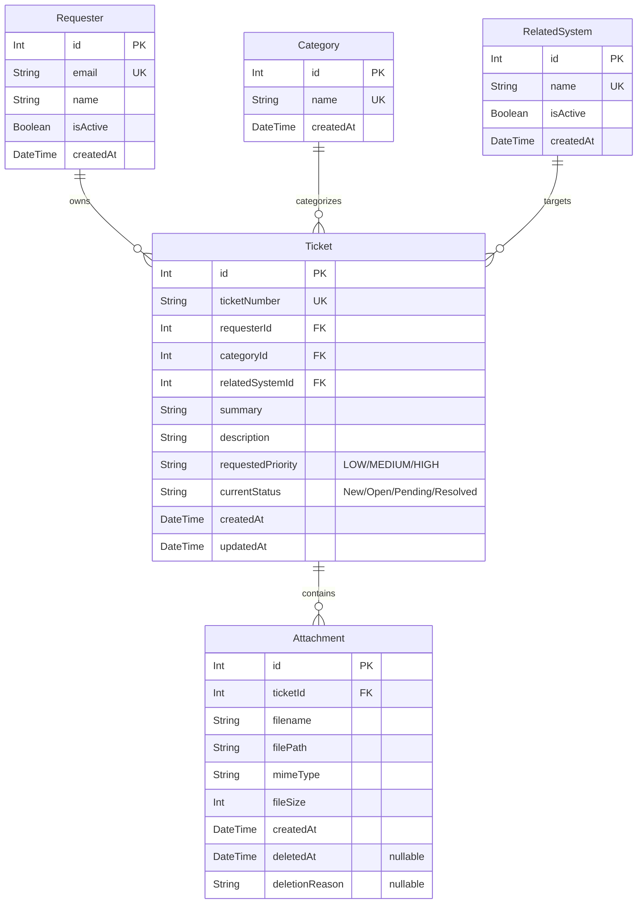

# Lab 2 Sprint Engineering Specification

## 1. Sprint Goal
Build and deliver a professional, responsive, and robust Requester-facing IT support ticketing MVP using the **Zen Green** design system. This sprint establishes a temporary Development Requester identity selection to simulate a multi-user environment, allows requesters to submit and track support tickets with multiple attachments (supporting search, sorting, filtering, and pagination), inspect ticket details, and manage attachment lifecycles with soft-removal rules.

## 2. Stakeholder Request Interpretation
The IT department needs a self-service web application for end-users (Requesters) to report issues. The system must allow users to select their category, affected system, priority, describe their problem, and upload attachments.
Requesters must be able to view their own tickets in a clean dashboard, search and filter them, and open a ticket detail screen. To simulate multi-user behavior before real authentication is added, we must provide a temporary "Development Requester Selector". We must enforce strict ownership (preventing one requester from viewing another's tickets) and implement a soft-removal mechanism for attachments with a stated reason.

## 3. Scope

### Included
*   **Development Requester Selector**: A mock login screen to select one of the active seeded requesters to set the session context.
*   **Create Ticket Form**: Capture category, related system, priority, summary, description, and up to 5 attachments.
*   **My Tickets Dashboard**: Search, filter by category/priority/status, sort, and paginate through owned tickets.
*   **Ticket Detail Screen**: Read-only display of ticket fields, historical attachments, and attachment upload/download/soft-removal.
*   **Attachment Management**: Support uploading JPG/JPEG, PNG, WEBP, and PDF files up to 5MB, downloading active files, and soft-removing files with a stated reason.
*   **Strict Access Control**: Verify requester ownership on all ticket-related backend endpoints and frontend views.

### Excluded
*   **Authentication & Security**: Passwords, encryption, sessions/cookies, token management, roles, and real RBAC (deferred to Lab 3).
*   **IT Staff Workflows**: Helpdesk dashboards, ticket assignment, updating IT priority, or changing status (tickets remain `New` unless advanced in future labs).
*   **Collaboration & Communication**: Ticket comments, internal notes, notifications, or actions logs. (Note: Only the static layout is rendered as a placeholder where required, but no interactive comment submission is implemented).
*   **Admin Dashboard**: Creating categories, systems, or managing user accounts.

---

## 4. Functional Requirements

*   **FR-01**: **Requester Selection**: The app must prompt the user to choose an active Development Requester before entering any ticketing screens.
*   **FR-02**: **App Header & Shell**: The app shell must display the selected Requester's name, their avatar/initials, and a "Change Requester" action to switch contexts.
*   **FR-03**: **Ticket Submission**: Requesters can fill out a form with a summary, description, priority, category, related system, and supporting files, then submit it.
*   **FR-04**: **Unique Ticket Numbering**: The system must generate a unique, formatted ticket number for each newly created ticket.
*   **FR-05**: **My Tickets Listing**: Requesters must be able to view their submitted tickets in a paginated list showing the ticket number, date, summary, category, priority, status, and last updated time.
*   **FR-06**: **Search and Filtering**: Requesters can search their tickets by ticket number or summary, and filter by Category, Priority, and Status.
*   **FR-07**: **Sorting**: The ticket list can be sorted by creation date, ticket number, or last updated date in ascending/descending order.
*   **FR-08**: **Ticket Details**: Requesters can open a ticket from their list to see a read-only details view of its metadata, description, and list of attachments.
*   **FR-09**: **Attachment Upload (Post-Creation)**: Requesters can add new permitted attachments to an existing ticket from the Ticket Detail view.
*   **FR-10**: **Attachment Soft Removal**: Requesters can remove an attachment they uploaded by providing a mandatory removal reason.

---

## 5. Business Rules (BR)

*   **BR-01 (Ticket Number Format)**: The official Ticket Number is generated by the backend and must be unique. The format is `TKT-YYYY-XXXXXX` where `YYYY` is the current calendar year (e.g. 2026) and `XXXXXX` is a zero-padded, sequential integer starting at `000001` (e.g. `TKT-2026-000001`).
*   **BR-02 (Initial Ticket Status)**: A new ticket always begins with a `Current Status` of `New`.
*   **BR-03 (Development Login)**: Lab 2 uses a Development Requester selector instead of login. The selected identity is stored in frontend storage (e.g., `localStorage`) for testing. Changing the identity must immediately refresh the app and reload user-specific data.
*   **BR-04 (Strict Ownership)**: Requesters can only access, search, view, download, or edit tickets and attachments where they are the designated owner (`requesterId` matches the session). The backend must validate the requester ID passed in headers/requests against the database, throwing HTTP `403 Forbidden` if there is a mismatch.
*   **BR-05 (Field Validation)**:
    *   **Ticket Summary**: Required, string, length 10 to 100 characters. Trim leading/trailing whitespace.
    *   **Description**: Required, string, length 20 to 1000 characters. Trim leading/trailing whitespace.
    *   **Category**: Required, must refer to an existing active Category ID in the database.
    *   **Related System**: Required, must refer to an existing active Related System ID in the database.
    *   **Requested Priority**: Required, must be one of: `LOW`, `MEDIUM`, `HIGH`. Default is `MEDIUM`.
*   **BR-06 (Attachment Formats)**: The only allowed mime types are: `image/jpeg` (JPG/JPEG), `image/png` (PNG), `image/webp` (WEBP), and `application/pdf` (PDF).
*   **BR-07 (Attachment File Size)**: The maximum file size per attachment is 5 MB (5,242,880 bytes). Files exceeding this limit must be rejected.
*   **BR-08 (Attachment Count Limit)**: A single ticket can have a maximum of 5 *active* (non-removed) attachments.
*   **BR-09 (Soft Removal)**: Attachments are never physically deleted from storage or database during a removal. Instead, they are soft-removed by setting `deletedAt = now()` and recording a mandatory `deletionReason` of 5 to 200 characters.
*   **BR-10 (Removed File Isolation)**: Soft-removed attachments remain listed in the ticket details for audit/metadata visibility (displaying a "Removed" badge and the removal reason), but the file's download, preview, and API retrieval endpoint must be completely blocked (returning HTTP `410 Gone` or `403 Forbidden`).
*   **BR-11 (Active Requesters Only)**: Only active Development Requesters can be selected or switch contexts. Inactive requesters must be seeded in the database to test that they are excluded from the dropdown and rejected if they attempt to call the API.
*   **BR-12 (Empty/No-results UI)**: If a requester has no tickets, the screen must display an empty-state card. If search/filters return no results, a "No matching tickets found" message must be shown.
*   **BR-13 (Duplicate Submission Prevention)**: While a ticket submission or attachment upload request is pending, the submit button must enter a disabled, busy loading state to prevent double-clicks and duplicate API calls.
*   **BR-14 (Atomic Creation Transaction)**: When submitting a new ticket, the ticket and all selected attachments are processed. If any attachment fails validation or upload, the entire operation is rolled back (database transaction aborts) and no partial ticket is saved, returning a descriptive validation error to the user so they can adjust files.
*   **BR-15 (API Error Handling)**: If any backend API call fails (network error, database outage), the frontend must display a localized, clean error callout message directly beneath the relevant form action, preserving the user's form inputs.

---

## 6. UI Specification Summary
The application follows the **Zen Green Theme** styling guide documented in [`ui-spec.md`](file:///c:/Users/aricl/OneDrive/Bureau/KMUTT_classes/swe/toktickit/docs/lab-02/ui-spec.md).
*   **Application Shell**: Top navigation bar with the TokTickIT logo, navigation tabs ("My Tickets", "Create Ticket"), and the active user profile widget showing the selected requester's name.
*   **Requester Selector**: Centered dialog card displaying a dropdown list of active requesters, an informational banner, and a "Continue" button.
*   **Create Ticket Page**: Form with inputs aligned vertically or in a two-column grid. Fields are marked with a red asterisk `*` when required. Responsive dropzone or file selector for attachments.
*   **My Tickets Page**: A searchable, filterable grid/table displaying ticket status, priority, number, summary, category, date, and owner. In mobile screens, this table collapses into readable cards.
*   **Ticket Detail Page**: Header bar with a back button, a grid of read-only ticket fields, and a dedicated card displaying active and soft-removed attachments.

---

## 7. Data Changes (Database Schema)

We will increment our Prisma PostgreSQL schema with the following models and relationships:

### Database Migration & Seed Plan
1.  **Migration**: Create database tables using Prisma migration `npx prisma migrate dev --name add_ticketing_models`.
2.  **Seeding (`prisma/seed.ts`)**:
    *   **Categories**: "Account and Access", "Hardware", "Software", and "Network".
    *   **Related Systems**: "Email", "Campus Wi-Fi", "VPN", "LEB2 App", "Grade Submission App", "Printer", and "Corporate Laptop" (all active).
    *   **Requesters**:
        *   Active: "Jennifer Anderson" (jennifer@kmutt.ac.th), "Michael Brown" (michael@kmutt.ac.th), "Sarah Johnson" (sarah@kmutt.ac.th), "David Lee" (david@kmutt.ac.th).
        *   Inactive: "John Doe" (john.doe@kmutt.ac.th) (must not appear in selection).

---

## 8. API Contract Summary
All endpoints are prefix-versioned at `/api` and return standardized JSON payloads. Full schemas, query parameters, error responses, and HTTP status codes are documented in [`api-spec.md`](file:///c:/Users/aricl/OneDrive/Bureau/KMUTT_classes/swe/toktickit/docs/lab-02/api-spec.md).

Endpoints summary:
*   `GET /api/requesters`: Returns active requesters.
*   `GET /api/categories`: Returns categories list.
*   `GET /api/systems`: Returns active related systems.
*   `POST /api/tickets`: Submits a new ticket with attachments (multi-part form data).
*   `GET /api/tickets`: Paginated, searchable, filterable list of tickets for the active requester.
*   `GET /api/tickets/:id`: Retrieves a single ticket detail (enforces ownership).
*   `POST /api/tickets/:id/attachments`: Uploads an attachment to an existing ticket.
*   `GET /api/attachments/:id`: Downloads an active attachment file.
*   `DELETE /api/attachments/:id`: Soft-removes an attachment.

---

## 9. Acceptance Criteria (AC)

*   **AC-01 (Successful Submission)**:
    *   **Given**: A valid selected Requester, category, related system, priority, and valid summary/description.
    *   **When**: The requester submits the ticket form.
    *   **Then**: The ticket is saved in the database with status `New`, a unique ticket number starting with `TKT-`, and a success screen is displayed.
*   **AC-02 (Unauthorized Access)**:
    *   **Given**: No Development Requester is selected.
    *   **When**: The user attempts to visit the dashboard or ticket details.
    *   **Then**: The application intercepts the navigation and redirects the user to the Development Requester Selection screen.
*   **AC-03 (Cross-Requester Security)**:
    *   **Given**: Requester A is selected.
    *   **When**: Requester A attempts to fetch or view a ticket belonging to Requester B.
    *   **Then**: The API returns HTTP `403 Forbidden` and the frontend shows an access denied error.
*   **AC-04 (My Tickets Filters & Pagination)**:
    *   **Given**: A list of tickets for the active requester.
    *   **When**: The requester selects a category filter or types a search query.
    *   **Then**: The list instantly filters matching items, adjusts pagination counts, and displays the correct subset.
*   **AC-05 (Attachment Constraints)**:
    *   **Given**: A file of type `.exe` or a file size of `6 MB`.
    *   **When**: The requester attempts to upload it.
    *   **Then**: The upload is blocked on the frontend with a clear validation message, and the API rejects the request with HTTP `400 Bad Request`.
*   **AC-06 (Attachment Soft Removal)**:
    *   **Given**: An active attachment on a ticket.
    *   **When**: The ticket owner clicks "Remove", provides a reason of "No longer needed", and confirms.
    *   **Then**: The attachment record is updated with `deletedAt` and `deletionReason`, it appears as "Removed" in the UI, and downloading the file is disabled/blocked.

---

## 10. Definition of Done (DoD)

- [ ] All specified functional requirements and business rules are fully implemented.
- [ ] Prisma schema is migrated and database is successfully seeded.
- [ ] Unit, API integration, UI component, and Playwright end-to-end tests are written, run, and pass with 100% green status.
- [ ] No tests are skipped, bypassed, or commented out.
- [ ] Application styling matches the Zen Green Theme specifications on desktop, tablet, and mobile layouts.
- [ ] Review documentation (`reviewer.md`) and AI reflection (`ai-use.md`) are filled in with accurate project data.
- [ ] Clean build passes for both backend (`npm run build`) and frontend (`npm run build`).

---

## 11. Assumptions and Decisions

1.  **Local Storage for Mock Session**: Since real authentication is excluded, the selected requester's database ID will be stored in local storage under `toktickit_requester_id` and included as a custom header `x-requester-id` on every API request.
2.  **Local File System Storage**: Uploaded files will be stored in a local directory (`server/uploads/`) on the server. The filename will be stored in the database with a unique timestamp prefix to prevent file collisions.
3.  **Static Comments Display**: To match the stakeholder's visual mockup, the UI detail screen will display static mock comments, but no comment submission or comment-saving database structure will be implemented.
